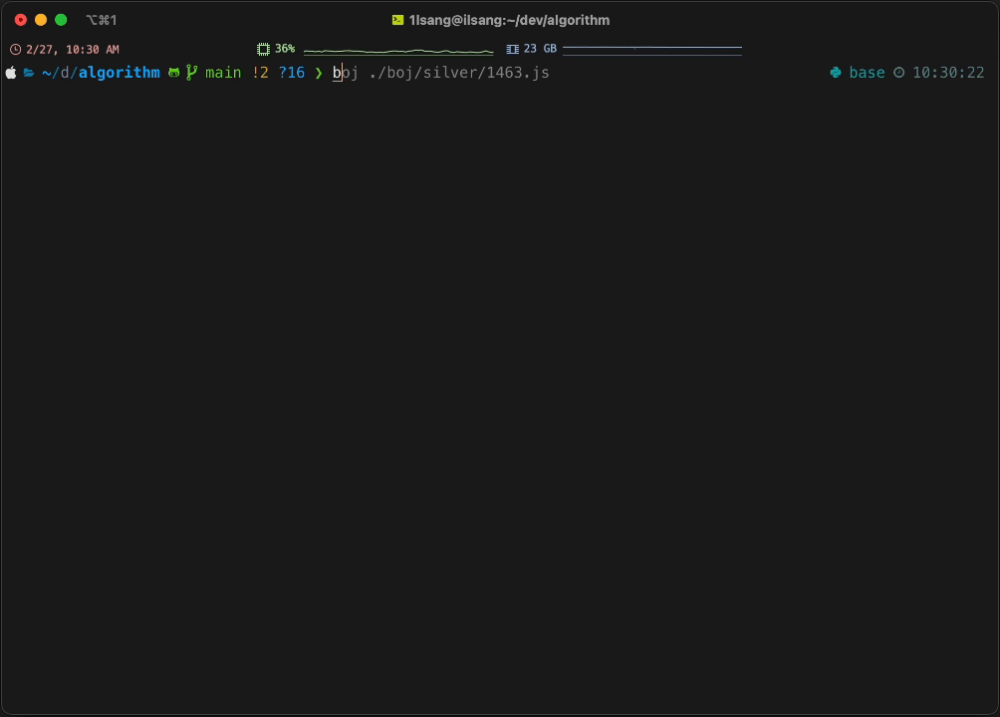

# BOJ.IO(Beta)

[](https://badge.fury.io/js/boj.io)

Baekjoon Online Judge 문제 풀이 검증 자동화 CLI

## Description
[Baekjoon Online Judge](https://www.acmicpc.net/)(이하 BOJ)에서 제공하는 문제 풀이 검증을 자동화하는 Command Line Tool입니다.
BOJ는 문제의 입력과 출력을 Standard I/O로 제공하고 있습니다. 이를 통해 문제 풀이를 검증할 수 있습니다. 
하지만 이를 수동으로 진행하는 것은 매우 번거로우며, 알고리즘 문제 풀이 시간을 낭비하게 됩니다. 
BOJ.IO는 이를 자동화하여 사용자가 편리하게 문제 풀이를 검증할 수 있도록 도와줍니다.

> [!WARNING]  
> 현재 Beta 버전으로, 아직 많은 기능이 미구현되어 있습니다.
> - 무한 루프, 무한 재귀 호출 등에 대해서 Timeout을 설정하지 않았으므로 주의해주세요.
> - 메모리 제한에 대한 설정도 미구현되어 있습니다.
> - 현재 JavaScript만 지원하며, 추후 다른 언어도 지원할 예정입니다.

## Language
- JavaScript
- 추후 다른 언어 지원 예정

## Usage

### 1. Local
1. boj.io를 알고리즘 문제 풀이 레포지토지에 설치합니다.
```sh
$ npm install -D boj.io
```

2. package.json에 scripts에 boj를 추가합니다.
```json
{
  "scripts": {
    "boj": "boj"
  }
}
```

3. 테스트를 실행합니다.
```sh
$ npm run boj <source>
# or
$ npm run boj <source> -pn <problemNumber>
# or
$ npm run boj <source> --problem-number <problemNumber>
```
- 파일명을 입력하면 해당 파일을 실행하여 테스트 결과를 출력합니다.
- 파일명은 <문제번호>.js 형식이어야 합니다. (예: 1000.js)
- 해당 형식이 아닐 경우, `-pn` 혹은 `--problem-number` 옵션을 통해 문제 번호를 입력할 수 있습니다.

### 2. Global
1. boj.io를 전역에 설치합니다.
```sh
$ npm install -g boj.io
```

2. 테스트를 실행합니다.
```sh
$ boj <source>
# or
$ boj <source> -pn <problemNumber>
# or
$ boj <source> --problem-number <problemNumber>
```
- 파일경로를 입력하면 해당 파일을 실행하여 테스트 결과를 출력합니다.
- 파일경로의 형식은 다음과 같습니다.
  - path는 상대경로 혹은 절대경로가 가능합니다.
  - 문제번호는 숫자 형식이어야 합니다.
  - 파일명은 <문제번호>.js 형식이어야 합니다. (예: 1000.js)
  - 해당 형식의 파일명이 아닐 경우, `-pn` 혹은 `--problem-number` 옵션을 통해 문제 번호를 입력할 수 있습니다.
  
## 실행 예시



## 지원 예정 기능
- 다른 언어 지원
- config 파일을 통한 설정
  - 파일명 형식 설정
  - 입출력 보기 여부 설정
- 테스트 케이스 추가
- 코드 실행 Timeout
- 코드 실행 메모리 제한